```{r setup, include=FALSE}
options(htmltools.dir.version = FALSE)
```


# Outline

.columnwide[
  ### 1) [Data, Data-related Projects and Data Science](#Introduction)
  ### 2) [Integrative Omics Data Analysis](#IODA)
  ### 3) [Open problems we work in](#IODAProjects)
  ### 4) [Biomedical data integration and data sharing](#DataSharing)
  ### 5) [Data Projects we work in](#DataProjects)
  ### 6) [Looking ahead](#Estrategia)
]

---

class: inverse, middle, center

name: Introduction

# Data, Data-related Projects and <br> Data Science <a id="Introduction"></a>

---

# The importance of Data 

## Data is essential to solve problems or answer questions

- Simplistically, when we wish to solve a problem we collect data

    - Statistics:     Questions --> [Hypothesis] --> Get data
    - Data Science:   Questions --> Get Data

- Data availability and complexity increases all the time

    - More (Big) data --> Better solutions? 
    
- 21st century holy grial:

    - __Data + AI --> Personalized medicine__
    
<!-- --- -->

<!-- # How did we get here? -->

<!-- - First we took traditional approach -->

<!-- - Then we made the leap into microarrays -->

<!-- - Next we moved into-multi-omics -->

<!-- - Now we look forward to combining it with clinical data -->

---

# From XXth century studies

## Traditional Statistical Analysis

.center[ 
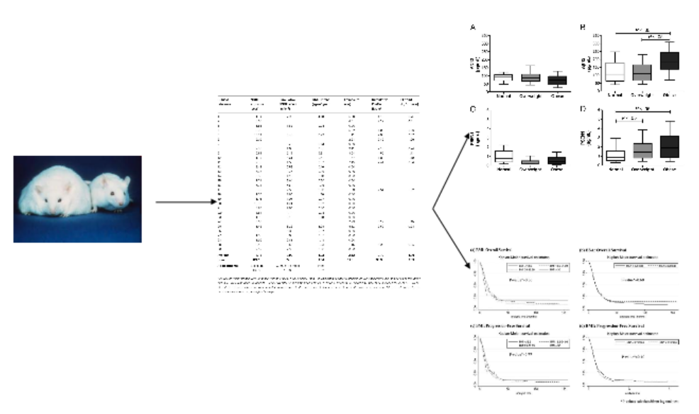 
 ] 

---

# To beginning of XXth 

## Microarrays: One dataset, _many_ genes

### Efron called the XXIst century "_The century of microarrays_"

.center[ 
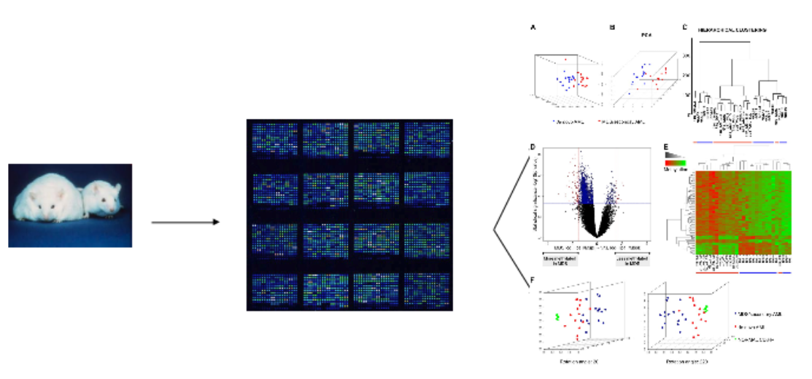
 ] 

---
# Why integration?

## The whole is more than the sum of parts

.center[ 
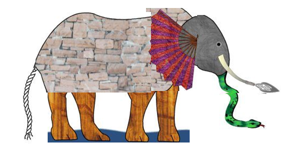 
 ]

---

# Why integration?

## We May lose important information

.center[ 
 
 ]

---
# Why integration?

## Don't forget the Omics Cascade

.center[ 
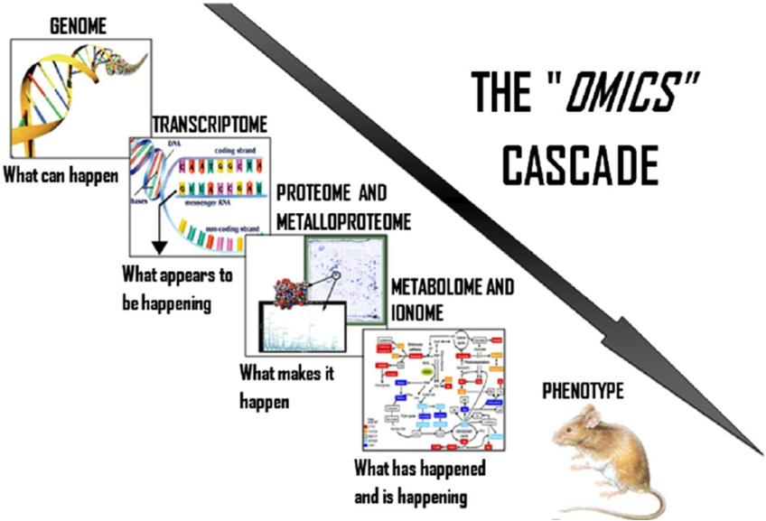 
 ]

---
# From single to multi-omics

## Integromics entered the game (_We want it all_)

.center[ 
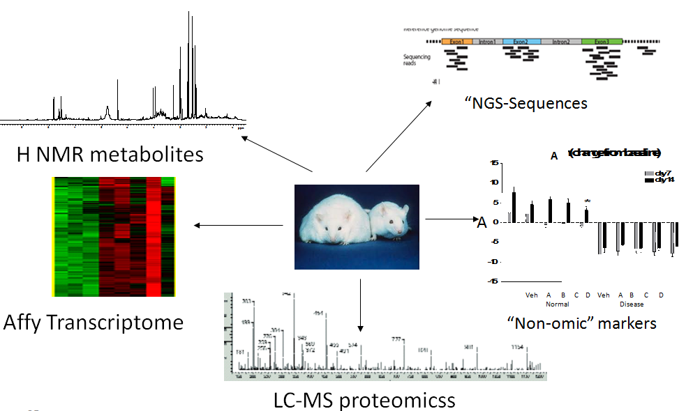 
 ]

---

# Can we get more data?

## From MultiOmics to Personalized Medicine


.center[ 
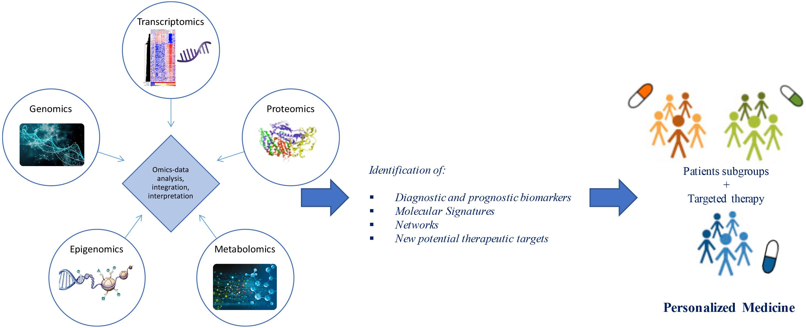 
]

Google "multi-omics for personalized medicine" images to see more ...

---

# Data-Centric Projects have become key

- The need to have multimodal data, including omics data, images, and clinical data <br>
has driven a multitude of __Research Projects__ <br>

- Their first or ultimate objective is to _facilitate the path to personalized medicine_ through:
.pull-left[
    - data integration 
    - data sharing, 
    - data exchange (OMOP, HL7)
    - data FAIRification,
    - cloud computing and 
    - (federated) data analysis,<br>
among others.
  ]
  
.pull-right[
 
]

<p>  
  
- This represents an _unprecedented opportunity_.
- But requires the right people and knowledge.

---


class: inverse, middle, center

name: IODA

# Integrative Omics Data Analysis

---

# The goal(s) of Integrative Omics

- The idea that efficient integration of data from different OMICS can facilitate the discovery of true causes and states of disease has pervaded the biomedical community.

- The general gol of integrative analysis is the _deciphering of complex biological relationships (CBP)_ empowered by the _combined use of distinct pieces of information_ that represent a, probably partial, view of the _different levels at which these processes happen_.

- More specifically integrative omics data anlysis is applied for
    - Disease subtyping,
    - Disease insights,
    - Biomarker development,
    - Combination with non-omics

---

# Methods of integrative analysis

.center[ 
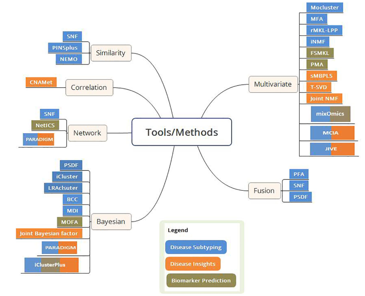 
]

Subramanian et alt., 2020. _Multi-omics Data Integration, Interpretation, and Its Application_


---

# Many data repositories

.center[ 
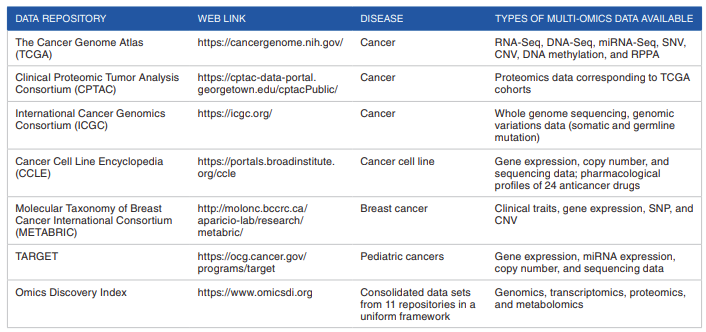 

Subramanian et alt., 2020. _Multi-omics Data Integration, Interpretation, and Its Application_
]

---

# Many data visualization portals

.center[ 
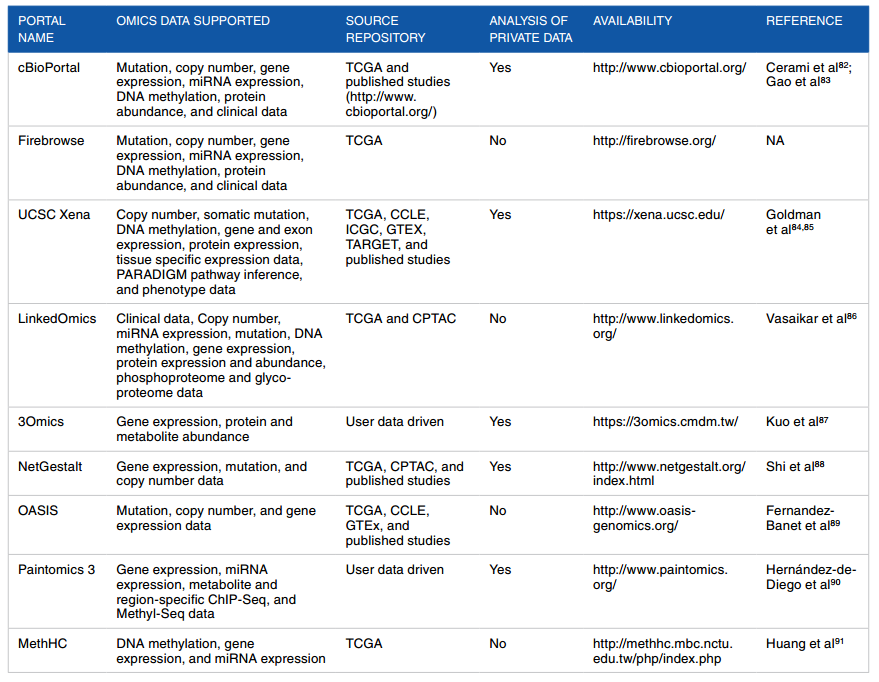 

Subramanian et alt., 2020. _Multi-omics Data Integration, Interpretation, and Its Application_
]

---

# So what?

- We willl restrict to arbitrarily chosen situations:

    - Multivariate statistical methods, classic and extensions 

- for which we will sketch,

    - General ideas
    - Use case
    
- and provide some examples of use.

    - See workshop

---

# General framework: Matrix factorization

- Matrix factorizations have become very popular in fields such as machine learning, recommender systems or deep learniong.

.center[ 
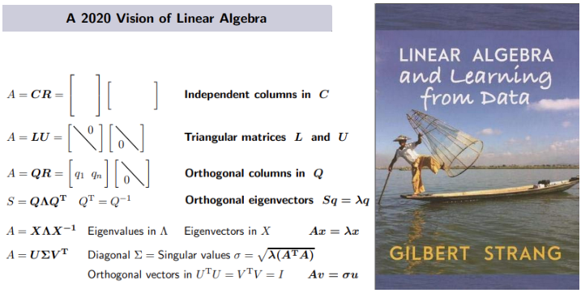 
]

_"Many key ideas of linear algebra, when you look at them closely, are really factorizations of a matrix, where the original matrix becomes the product of 2 or 3 special matrices."_ <br>
Gilbert Strang.

---

class: inverse, middle, center

name: IODAProjects

# Open problems we work in


---

class: inverse, middle, center

name: DataSharing

# Biomedical data integration <br> and data sharing

---

# Precision or Personalized Medicine

- Two patients with the same disease can respond very differently to the same treatment. 

- Why? Mainly due to the different genomic characteristics of each one. 

- Precision or Personalized Medicine aims at helping physicians to select the treatments that are most likely to help patients based on their genetics.

- PM is currently experiencing significant advances due to the appearance of new diagnostic and computer methods that provide an understanding of the molecular bases of the disease, particularly of the genomics. 

---

# Personalized Medicine at a Scale

## The need for a paradigm change

- Until recently, PM  has been associated with experimental therapies _far from daily clinical practice_ 

- But its central elements arae now much easier to reach:

  - Increasing availability of Genomic Data, fast and cheap to produce
  - Increasing computing power in-house or in the cloud (EOSC)
  - Possibility of accessing clinical data in anonymized possibly federated ways
  
- Having the ability to __integrate__ genomic, clinical and other social, environmental and behavioral factors, will (should) lead to a transformation in the way in which decisions are made with direct effect on clinical practice and public health measures.
  <!-- - improving diagnosis,  -->
  <!-- - improving treatments or  -->
  <!-- - increasing the ability to predict the development of diseases. -->

- The ultimate goal is a safer, more efficient, preventive, and predictive medicine. 

---

# How will this be done (in Spain)

## The IMPaCT program

- In mid-September 2020, the Council of Ministers approved the call for granting grants for the __Precision Medicine Infrastructure associated with Science and Technology__ (__IMPaCT__) of the Strategic Action in Health 2017-2020.

- This decision, which involved the granting of 25.8 million euros to the Carlos III Health Institute (ISCIII)

- The programs included in IMPaCT are aligned with several areas that will be developed in the future national strategy:

  - Predictive medicine; 
  - Genomic medicine and 
  - Data science. 
  
---

# The Predictive Medicine Program

.pull-left[

- Aimed at the design and implementation of _a large population cohort with clinical, epidemiological and biological data, measured at the individual level_, 

- which allows representing the entire population residing in Spain, 

- including the ethnic variability and geographic and environmental diversity.

- __Data sharing__ is an essential aspect: clinical data needs to be accessible for this program to be possible.

<!-- This will make it possible to build predictive models of disease, identify health inequalities, monitor key indicators and evaluate the impact of health policies ”, continued Raquel Yotti. -->

]

.pull-right[
 

]
---

# The Genomic Medicine Program

.pull-left[

- It will develop _coordination infrastructures and protocols_ to carry out genomic analyzes and other 'omic' data in an effective, efficient and equitable accessible manner.

- It will take as support large research centers that already have of state-of-the-art sequencing technology and experience in its application to the diagnosis of human diseases. 

- It will optimize and reinforce the available massive sequencing capacities, orienting them to the needs of genetic diagnosis -exomes, complete genomes, etc.- 
]

.pull-right[
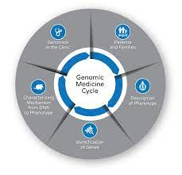 

]
---

# The Data Science Program

- _Develop a system for the collection, integration and analysis of clinical and molecular data__
aimed at improving the health of each individual patient, and 

- Which allows the secondary use of existing information in the SNS to the benefit of society with the objectives of public health, health planning and research. 

- Its objective is to __optimize the management of the information generated__, in order to apply it in the most effective way for the population and the SNS. 

- It will provide 

  - _bioinformatics tools_ for the management of genomic data and 
  - _medical informatics_ solutions for the _management_ and _integration_ of clinical data, 
  
facilitating the interoperability of the clinical information systems of the different autonomous health systems.

---

class: inverse, middle, center

name: DataProjects

# Data Projects we work in

---

# The Data Science Projects Platform @VHIR


.center[ 
 
 ] 

---

# Alguns projectes _externs_

- Principals

  - EOSC-Life 

  - EU-PEARL 

  - VEIS

  - _IMPACT_

- Altres

  - EHDEN/OMOP al VH
  
  - EUHA/TEHDAS al VH

  - DARWIN & EMA al VH/VHIR

---

# Alguns projectes Interns

- Liderats per nosaltres

  - Comissió Mixta VH/VHIR per a l'ús secundari de les dades

  - Creació d'un catàleg de dades de COVID
  
  
- Co-participats

  - Implementació de DMPs per als projectes de recerca
  
  - Repositoris de dades i ciència oberta

  - Implementació d'una plataforma per a l'anàlisi integrada de dades 

---

class: inverse, middle, center

name: Estrategia

# Looking ahead


